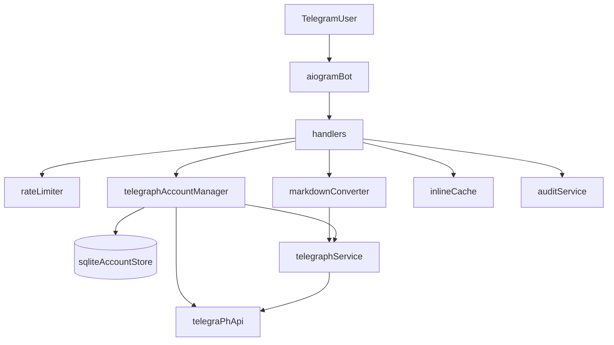

# Architecture

- `app/main.py` — запуск бота и wiring зависимостей.
- `app/config.py` — единая конфигурация через `pydantic-settings`.
- `app/bot/handlers.py` — Telegram handlers.
- `app/services/md_converter.py` — Markdown -> Telegraph HTML.
- `app/services/telegraph_service.py` — публикация и шардинг.
- `app/services/audit_service.py` — аудит метаданных.
- `app/services/rate_limit_service.py` — анти-абуз лимитер.
- `app/services/account_manager.py` — персональные аккаунты и выбор publish-контекста.
- `app/services/account_store.py` — SQLite-хранилище профилей personal/shared.
- `app/services/inline_cache_service.py` — in-memory cache для inline-запросов.
