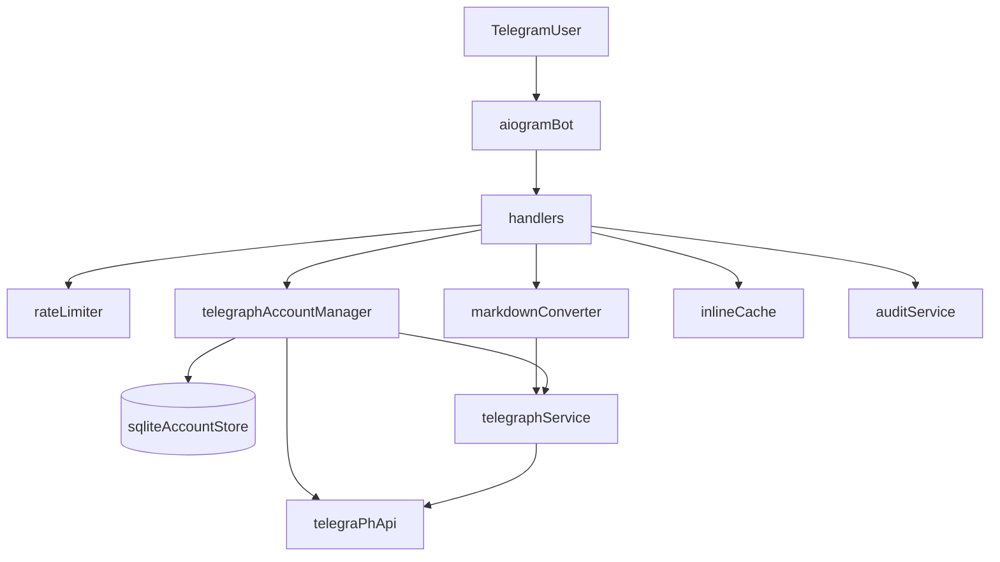

# Architecture

- `app/main.py` — bot startup and dependency wiring.
- `app/config.py` — configuration via `pydantic-settings`.
- `app/bot/handlers.py` — Telegram handlers.
- `app/services/md_converter.py` — Markdown → Telegraph HTML.
- `app/services/telegraph_service.py` — publishing and page splitting.
- `app/services/audit_service.py` — audit metadata.
- `app/services/rate_limit_service.py` — abuse-prevention rate limiter.
- `app/services/account_manager.py` — personal accounts and publish context.
- `app/services/account_store.py` — SQLite store for personal/shared profiles.
- `app/services/inline_cache_service.py` — in-memory cache for inline queries.
