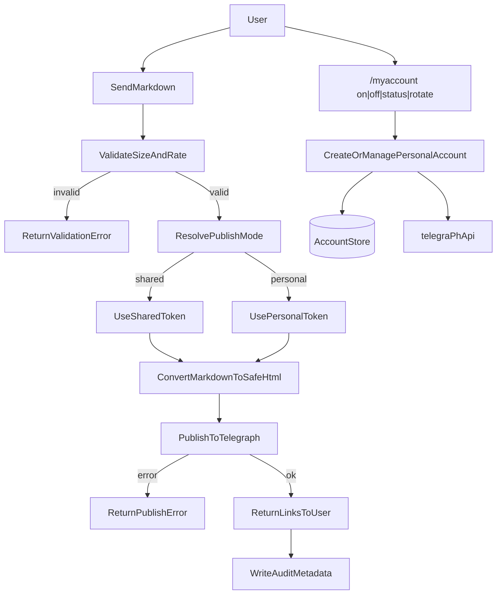

# User Flow

1. Incoming message from the user.
2. Rate limit and size validation.
3. Markdown → safe HTML.
4. Publish to Telegraph (1..N pages).
5. Reply with link(s).
6. Audit request metadata.

Optional:

7. User enables personal mode with `/myaccount on`.
8. The bot calls `createAccount` and stores the token in the local database.
9. Further publishes use the user’s personal author name.
