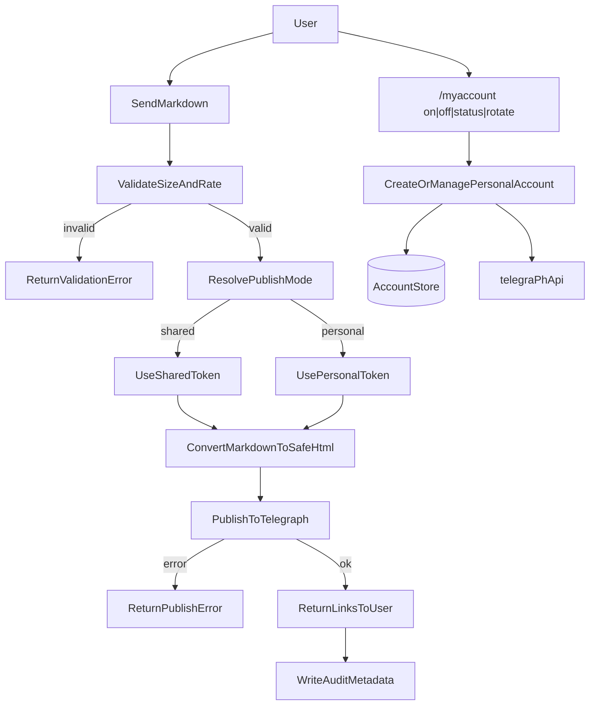

# User Flow

1. Входящее сообщение от пользователя.
2. Rate-limit и валидация размера.
3. Конвертация Markdown -> безопасный HTML.
4. Публикация в Telegraph (1..N страниц).
5. Ответ пользователю ссылкой(ами).
6. Аудит метаданных запроса.

Опционально:
7. Пользователь включает personal-режим через `/myaccount on`.
8. Бот создает Telegraph-account через `createAccount` и сохраняет токен в локальную БД.
9. Дальнейшие публикации идут от персонального имени пользователя.
